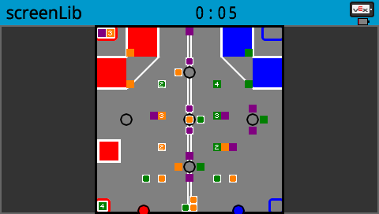

ScreenLib
=========
ScreenLib is a PROS library that handles screen drawing functions,
primarily printing each games field. It provides a powerful way to
draw any possible field without requiring experience with [lvgl](https://littlevgl.com/)

Installing
==========
* Go over to [releases](https://github.com/SpencerJ21/screenlib/releases) and download the latest version
* Open a terminal wherever you downloaded it(try shift + right click in file explorer)
* run `prosv5 c fetch screenlib@VERSION.zip`, replacing VERSION with the version
* run `prosv5 c apply screenlib` in your project directory to install

Usage
=====
Object drawing is mostly done through a `Field` object, by giving a position enum class and a bitfield of which cubes to print.

An example of this is:  
`field.drawCubeGroup(screen::cubeSector::right4, 0b00001010);`

Let's take a look at how the field is represented

Each of the cube group names are in `screen::cubeSector`,  
each of the tower names are in `screen::towerPos`, and  
each of the scoring zone names are in `screen::zonePos`

The numbers on the cube show the bit that represents them in their bitfield:  
a 0 means it's looking at bit 0: `0b0000000X`  
a 1 means it's looking at bit 1: `0b000000X0`  
and so on.

This is done so the presence of every cube in a group can be given by a number  
say you want the cubes labeled 3, 1, and 0, the bitfield would be `0b00001011`
